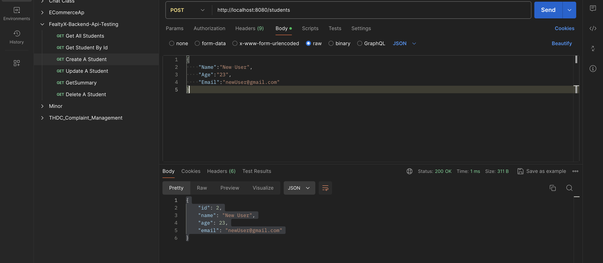
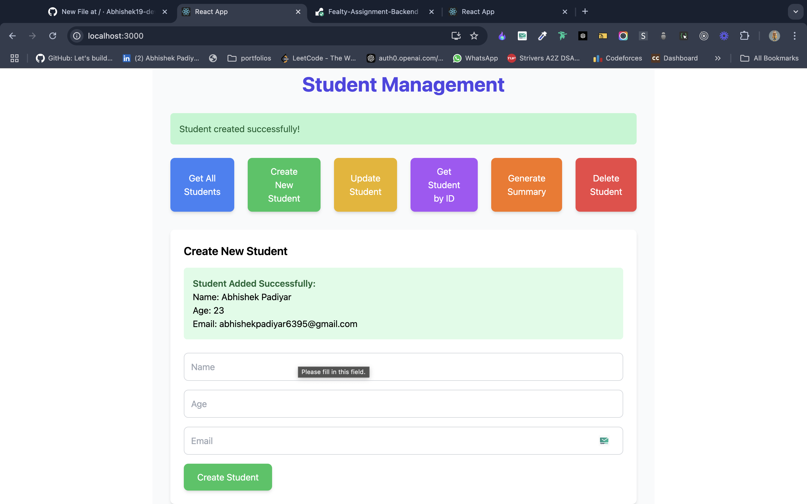

# Fealty-Assignment-Backend

A simple React-based application to manage student records. It provides functionality for creating, updating, retrieving, and deleting student information.

## Screenshots

### Postman - API Request


### Application Page


---

## Backend Setup (Go)

### 1. Install Go

First, make sure that Go is installed on your system. You can download it from the [official Go website](https://golang.org/dl/).

### 2. Clone the Repository

Clone the repository to your local machine using Git:

```bash
git clone https://github.com/yourusername/student-management.git:
```

### 3.Navigate to the backend directory:

Clone the repository to your local machine using Git:

```bash
cd Fealty-Assignment-backend/backend
```

### 4.Run this command

```bash
go mod init fealtyx-assignment
```

### 5. Start the Go Backend 

```bash
go run main.go
```


## FRONTEND Setup (React)

### 1. Install Node.js

Make sure you have Node.js installed. If not, download and install it from the official Node.js website.


### 2.Navigate to the frontend directory:


```bash
cd Fealty-Assignment-backend/frontend
```

### 3.Install Dependencies


```bash
npm install
```
### 4.Start the React Development Server

```bash
npm start
```


